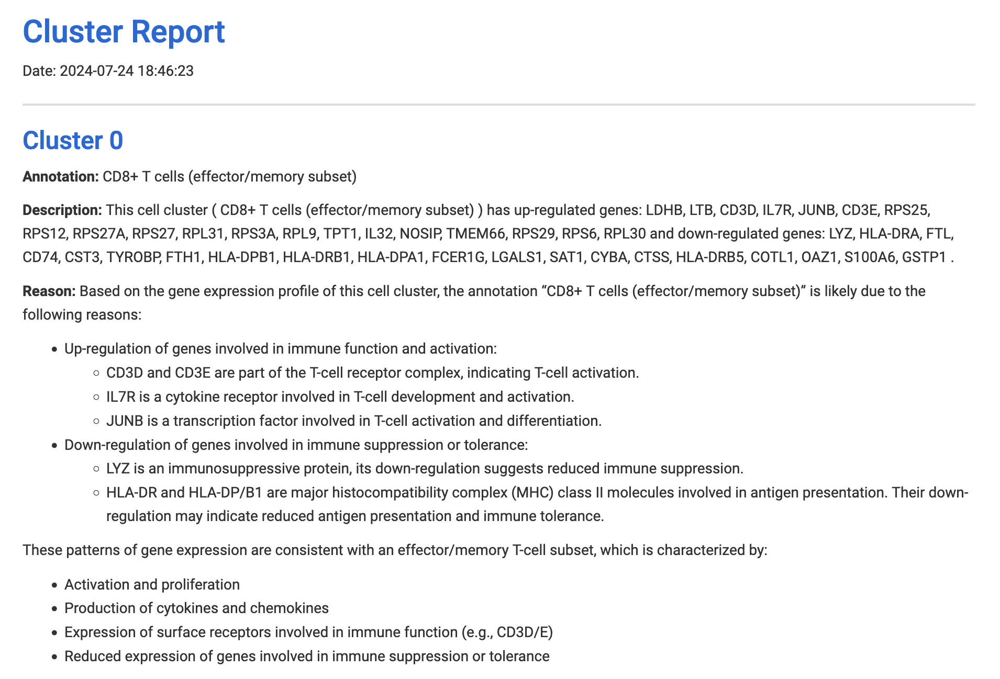

```{r setup, include=FALSE}
knitr::opts_chunk$set(echo = TRUE)
```


ceLLama is a streamlined automation pipeline for cell type annotations using large-language models (LLMs).

### Advantages:

- **Privacy**: Operates locally, ensuring no data leaks.
- **Comprehensive Analysis**: Considers negative genes.
- **Speed**: Efficient processing.
- **Extensive Reporting**: Generates customized reports.

ceLLama is ideal for quick and preliminary cell type checks!

> [!NOTE]\
> Check the [tutorial](ceLLama/pbmc2700.ipynb) for Scanpy example.

## Installation

To install ceLLama, use the following command:
```{r eval=FALSE}
devtools::install_github("CelVoxes/ceLLama")
```

## Usage

#### Step 1: Install Ollama

Download [`Ollama`](https://ollama.com/).

#### Step 2: Choose Your Model

Select your preferred model. For instance, to run the Llama3 model, use the following terminal command:

```{bash eval=FALSE}
ollama run llama3.1
```

This initiates a local server, which can be verified by visiting http://localhost:11434/. The page should display "Ollama is running".

#### Step 3: Annotate Cell Types

Load the required libraries and data:
```{r pbmc2700, message=FALSE, warning=FALSE}
library(Seurat)
library(tidyverse)
library(httr)

pbmc.data <- Read10X("../../Downloads/filtered_gene_bc_matrices/hg19/")

pbmc <- CreateSeuratObject(counts = pbmc.data, project = "pbmc3k", min.cells = 3, min.features = 200)
pbmc[["percent.mt"]] <- PercentageFeatureSet(pbmc, pattern = "^MT-")
pbmc <- subset(pbmc, subset = nFeature_RNA > 200 & nFeature_RNA < 2500 & percent.mt < 5)

# note that you can chain multiple commands together with %>%
pbmc <- pbmc %>%
    SCTransform(verbose = F) %>%
    RunPCA(verbose = F) %>%
    FindNeighbors(dims = 1:10, verbose = F) %>%
    FindClusters(resolution = 0.5, verbose = F) %>%
    RunUMAP(dims = 1:10, verbose = F)

DimPlot(pbmc, label = T, label.size = 3) + theme_void() + theme(aspect.ratio = 1)
```

Identify cluster markers:
```{r find DEGs}
DefaultAssay(pbmc) <- "RNA"

# Find cluster markers
pbmc.markers <- FindAllMarkers(pbmc, verbose = F, min.pct = 0.5)

# split into a lists per cluster
pbmc.markers.list <- split(pbmc.markers, pbmc.markers$cluster)
```

Run ceLLama:
```{r run ceLLama}
# set seed, make temperature 0 for reproducible results
library(ceLLama)

res <- ceLLama(pbmc.markers.list, temperature = 0, seed = 101, n_genes = 30)
```

> [!TIP]\
> Increase `temperature` to diversify outputs.
> Set different `base_prompt` to customize annotations.

Transfer the labels:
```{r transfer annotations}
# transfer the labels
annotations <- map_chr(res, 1)

Idents(pbmc) <- "seurat_clusters"
names(annotations) <- levels(pbmc)
pbmc <- RenameIdents(pbmc, annotations)

DimPlot(pbmc, label = T, repel = T, label.size = 3) + theme_void() + theme(aspect.ratio = 1) & NoLegend()
```


## Chain of Thought (Experimental)

Here, we can utilize [thinkR](https://github.com/eonurk/thinkR) package for annotation. The goal of this approach is to leverage the modal's capabilities to break down complex reasoning processes into structured steps. This stepwise decomposition in principle should allow for clear annotations, capturing the intermediate thinking and decision-making throughout an analysis or problem-solving task.

```{r}
# devtools::install_github("eonurk/thinkR")
library(thinkR)
```


```{r eval=FALSE}
# use_thinkR = T
res <- ceLLama(pbmc.markers.list, temperature = 0, seed = 101, n_genes = 30, use_thinkR = T, 
               base_prompt = "This is from a PBMC dataset. Act like an expert immunologist and give me the cell type annotation for this cluster. ")
```

<details><summary>Thinking...</summary>
```{r echo=FALSE}
# Assuming `res` contains the results to be displayed in markdown format
res <- readRDS("thinkR_results.rds")

# Formatting the output properly for markdown
output <- paste(
  unlist(lapply(res, function(res_inner){
    lapply(res_inner$annotation$steps, function(m) {
      
      if (!is.null(m$title) && !is.null(m$content) && !is.null(m$thinking_time)) {
        sprintf(
          "### %s\n\n%s\n\n**Time:** %s s\n\n---\n", 
          m$title, m$content, m$thinking_time
        )
      }
      
    })
  })),
  collapse = "\n"
)

# Printing the output for markdown without c("")
cat(output)
```
</details>

```{r echo=FALSE}
# Load necessary package for parsing JSON
library(jsonlite)

# Assuming `res` contains the structured results as described
res <- readRDS("thinkR_results.rds")

# Extracting the final answers in a clean format
final_annotations <- sapply(res, function(res_inner) {
  # Retrieve all steps from the annotation
  steps <- res_inner$annotation$steps
  
  # Find the step with title "Final Answer" and extract its content
  final_step <- Filter(function(step) step$title == "Final Answer", steps)
  
  # Extract and parse the content of the "Final Answer" step
  if (length(final_step) > 0) {
    content <- trimws(final_step[[1]]$content)  # Trim whitespace
    
    # Attempt to parse content as JSON, if it is in JSON format
    parsed <- tryCatch(fromJSON(content), error = function(e) NULL)
    
    # If parsed successfully, extract the relevant field
    if (!is.null(parsed)) {
      paste0(trimws(parsed$content), " (Confidence: ", parsed$confidence, ")")
    } else {
      content  # Return content as is if not JSON
    }
  } else {
    NA  # If no final answer is found, return NA
  }
})

# Print the final answers in a clean format
cat(paste(final_annotations, collapse = "\n"))
```

```{r}
Idents(pbmc) <- "seurat_clusters"
names(final_annotations) <- levels(pbmc)
pbmc <- RenameIdents(pbmc, final_annotations)

DimPlot(pbmc, label = T, repel = T, label.size = 3) + theme_void() + theme(aspect.ratio = 1) & NoLegend()
```


## Using OpenAI API
You can also use OpenAI for annotating your cell types.

> [!WARNING]\
> This will send data to OpenAI!

First, you can to create a `.Renviron` file where you keep your API key.
`OPENAI_API_KEY="Best_key_ever"`

```{r}
# Default is gpt-4o-mini
res.openai <-
    ceLLama(pbmc.markers.list, temperature = 0, seed = 101, n_genes = 30,
        use_openai = T, # money brr.
        model = "gpt-4o-mini", # set the model
        openai_api_key = Sys.getenv("OPENAI_API_KEY") # or just copy/paste
    )

# transfer the labels
annotations <- map_chr(res.openai, 1)

Idents(pbmc) <- "seurat_clusters"
names(annotations) <- levels(pbmc)
pbmc <- RenameIdents(pbmc, annotations)

DimPlot(pbmc, label = T, repel = T, label.size = 3) + theme_void() + theme(aspect.ratio = 1) & NoLegend()
```


## Creating Reports

Generate detailed reports explaining the annotations:
```{r eval=FALSE}
# Get the reason for the annotation! (a bit slower)
res <- ceLLama(pbmc.markers.list, temperature = 0, seed = 101, get_reason = T)

# These creates html report in the current directory
generate_report_md(res)
create_html_report()
```



View the full report [here](report.html).


## Disclaimer

> [!IMPORTANT]\
> LLMs make mistakes, please check important info.

## License
This project is licensed under the CC BY-NC 4.0 License. For more details, visit [here](https://creativecommons.org/licenses/by-nc/4.0/).

