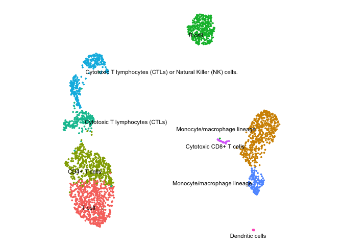

ceLLama
================


ceLLama is a streamlined automation pipeline for cell type annotations
using large-language models (LLMs).

### Advantages:

- **Privacy**: Operates locally, ensuring no data leaks.
- **Comprehensive Analysis**: Considers negative genes.
- **Speed**: Efficient processing.
- **Extensive Reporting**: Generates customized reports.

ceLLama is ideal for quick and preliminary cell type checks!

> \[!NOTE\]  
> Check the [tutorial](ceLLama/pbmc2700.ipynb) for Scanpy example.

## Installation

To install ceLLama, use the following command:

``` r
devtools::install_github("CelVoxes/ceLLama")
```

## Usage

#### Step 1: Install Ollama

Download [`Ollama`](https://ollama.com/).

#### Step 2: Choose Your Model

Select your preferred model. For instance, to run the Llama3 model, use
the following terminal command:

``` bash
ollama run llama3.1
```

This initiates a local server, which can be verified by visiting
<http://localhost:11434/>. The page should display “Ollama is running”.

#### Step 3: Annotate Cell Types

Load the required libraries and data:

``` r
library(Seurat)
library(tidyverse)
library(httr)

pbmc.data <- Read10X("../../../Downloads/filtered_gene_bc_matrices/hg19/")

pbmc <- CreateSeuratObject(counts = pbmc.data, project = "pbmc3k", min.cells = 3, min.features = 200)
pbmc[["percent.mt"]] <- PercentageFeatureSet(pbmc, pattern = "^MT-")
pbmc <- subset(pbmc, subset = nFeature_RNA > 200 & nFeature_RNA < 2500 & percent.mt < 5)

# note that you can chain multiple commands together with %>%
pbmc <- pbmc %>%
    SCTransform(verbose = F) %>%
    RunPCA(verbose = F) %>%
    FindNeighbors(dims = 1:10, verbose = F) %>%
    FindClusters(resolution = 0.5, verbose = F) %>%
    RunUMAP(dims = 1:10, verbose = F)

DimPlot(pbmc, label = T, label.size = 3) + theme_void() + theme(aspect.ratio = 1)
```

<!-- -->

Identify cluster markers:

``` r
DefaultAssay(pbmc) <- "RNA"

# Find cluster markers
pbmc.markers <- FindAllMarkers(pbmc, verbose = F, min.pct = 0.5)

# split into a lists per cluster
pbmc.markers.list <- split(pbmc.markers, pbmc.markers$cluster)
```

Run ceLLama:

``` r
# set seed, make temperature 0 for reproducible results
library(ceLLama)

res <- ceLLama(pbmc.markers.list, temperature = 0, seed = 101, n_genes = 30)
```

    ## >> Response: Activated T cells (Teff) or possibly a subset of activated CD4+ T cells.

    ## >> Response: Monocyte/Macrophage

    ## >> Response: Activated T cells (CD8+ T cells)

    ## >> Response: B cells (CD79A, CD74, CD79B, HLA-DRA, MS4A1, TCL1A) with a subset of activated B cells or plasma cells (elevated expression of HLA-DR and other MHC class II genes).

    ## >> Response: Activated T cells (CD4+ or CD8+)

    ## >> Response: CD8+ T cells (cytotoxic T cells)

    ## >> Response: Macrophage/Monocyte

    ## >> Response: CD8+ T cells (cytotoxic T cells)

    ## >> Response: Activated Macrophage/Immune Cell

    ## >> Response: Dendritic cells (DCs) or possibly monocytes/macrophages.

> \[!TIP\]  
> Increase `temperature` to diversify outputs. Set different
> `base_prompt` to customize annotations.

Transfer the labels:

``` r
# transfer the labels
annotations <- map_chr(res, 1)

names(annotations) <- levels(pbmc)
pbmc <- RenameIdents(pbmc, annotations)

DimPlot(pbmc, label = T, repel = T, label.size = 3) + theme_void() + theme(aspect.ratio = 1) & NoLegend()
```

<!-- -->

## Using OpenAI API

You can also use OpenAI for annotating your cell types.

First, you can to create a `.Renviron` file where you keep your API key.
`OPENAI_API_KEY="Best_key_ever"`

``` r
# Default is gpt-4o-mini
res.openai <-
    ceLLama(pbmc.markers.list, temperature = 0, seed = 101, n_genes = 30,
        use_openai = T, # money brr.
        model = "gpt-4o-mini", # set the model
        openai_api_key = Sys.getenv("OPENAI_API_KEY") # or just copy/paste
    )
```

    ## gpt-4o-mini is being used!

    ## >> Response: T cell

    ## gpt-4o-mini is being used!

    ## >> Response: Monocyte/macrophage lineage.

    ## gpt-4o-mini is being used!

    ## >> Response: CD4+ T cells

    ## gpt-4o-mini is being used!

    ## >> Response: B cell.

    ## gpt-4o-mini is being used!

    ## >> Response: Cytotoxic T lymphocytes (CTLs)

    ## gpt-4o-mini is being used!

    ## >> Response: Cytotoxic T lymphocytes (CTLs) or Natural Killer (NK) cells.

    ## gpt-4o-mini is being used!

    ## >> Response: Monocyte/macrophage lineage

    ## gpt-4o-mini is being used!

    ## >> Response: Cytotoxic CD8+ T cells

    ## gpt-4o-mini is being used!

    ## >> Response: Dendritic cells

    ## gpt-4o-mini is being used!

    ## >> Response: Megakaryocyte

``` r
# transfer the labels
annotations <- map_chr(res.openai, 1)

names(annotations) <- levels(pbmc)
pbmc <- RenameIdents(pbmc, annotations)
```

    ## Warning: Cannot find identity NA

``` r
DimPlot(pbmc, label = T, repel = T, label.size = 3) + theme_void() + theme(aspect.ratio = 1) & NoLegend()
```

<!-- -->

## Creating Reports

Generate detailed reports explaining the annotations:

``` r
# Get the reason for the annotation! (a bit slower)
res <- ceLLama(pbmc.markers.list, temperature = 0, seed = 101, get_reason = T)

# These creates html report in the current directory
generate_report_md(res)
create_html_report()
```


View the full report [here](report.html).

## Disclaimer

> \[!IMPORTANT\]  
> LLMs make mistakes, please check important info.

## License

This project is licensed under the CC BY-NC 4.0 License. For more
details, visit [here](https://creativecommons.org/licenses/by-nc/4.0/).
