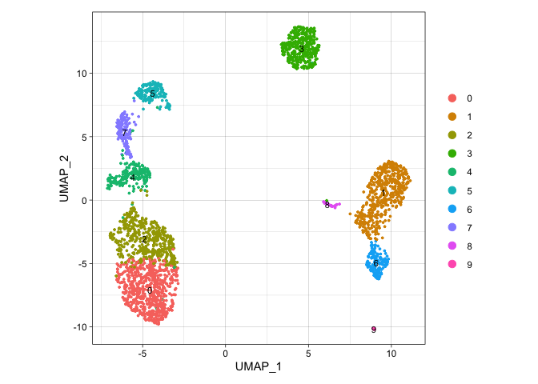
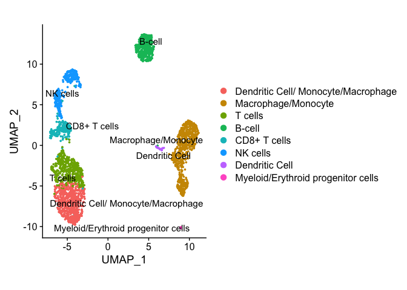

ceLLama
================

ceLLama is a simple automation pipeline for cell type annotations using
large-language models (LLMs).

It has several advantages:

- Works locally, thus no information leak.
- Takes negative genes into account.
- Quite fast.
- Trained on almost all internet!

But it also comes with downsides:

- It is not 100% accurate, needs re-running
- Not exactly reproducible

However, ceLLama can be super useful for quick&dirty cell type checks!

## How to use

First, you need to download [`ollama`](https://ollama.com/).

Then you can choose the model of your choice. Currently, one of the best
open source LLM models is Llama3. You can run it on your terminal simply
using:

``` bash
ollama run llama3
```

This starts a local server on your machine, and you can see if it is
running by checking <http://localhost:11434/>. It should say “Ollama is
running”.

Then you are ready to go!

``` r
library(Seurat)
library(dplyr)
library(httr)

pbmc.data <- Read10X("../../Downloads/filtered_gene_bc_matrices/hg19/")

pbmc <- CreateSeuratObject(counts = pbmc.data, project = "pbmc3k", min.cells = 3, min.features = 200)
```

    ## Warning: Feature names cannot have underscores ('_'), replacing with dashes
    ## ('-')

``` r
pbmc[["percent.mt"]] <- PercentageFeatureSet(pbmc, pattern = "^MT-")

pbmc <- subset(pbmc, subset = nFeature_RNA > 200 & nFeature_RNA < 2500 & percent.mt < 5)

# note that you can chain multiple commands together with %>%
pbmc <- SCTransform(pbmc, verbose = F) %>%
    RunPCA(verbose = F) %>%
    FindNeighbors(dims = 1:10, verbose = F) %>%
    FindClusters(resolution = 0.5, verbose = F) %>% 
    RunUMAP(dims = 1:10, verbose = F)
```

    ## Warning: The default method for RunUMAP has changed from calling Python UMAP via reticulate to the R-native UWOT using the cosine metric
    ## To use Python UMAP via reticulate, set umap.method to 'umap-learn' and metric to 'correlation'
    ## This message will be shown once per session

``` r
DimPlot(pbmc, label = T)
```

<!-- -->

``` r
# Find cluster markers
pbmc.markers <- FindAllMarkers(pbmc, verbose = F)

# split into a lists per cluster
pbmc.markers.list <- split(pbmc.markers, pbmc.markers$cluster)

# Select top 20 up-regulated and down-regulated genes
top_genes <- lapply(pbmc.markers.list, function(degs) {
    up_genes <- degs[order(degs$avg_log2FC, decreasing = TRUE), "gene"][1:20]
    down_genes <- degs[order(degs$avg_log2FC, decreasing = FALSE), "gene"][1:20]
    list(up = up_genes, down = down_genes)
})

# Format for Ollama
annotation_data <- lapply(names(top_genes), function(cluster) {
    up_genes <- paste(top_genes[[cluster]]$up, collapse = ", ")
    down_genes <- paste(top_genes[[cluster]]$down, collapse = ", ")
    paste("This cell cluster (", cluster, ") has up-regulated genes:", up_genes, "and down-regulated genes:", down_genes, ". 
          Give me the cell type annotation for this cluster. Please, only the answer and nothing else! If you're not sure just label it as 'unsure'.")
})

# Annotate using Ollama
annotate_cluster <- function(description) {
    url <- "http://localhost:11434/api/generate"
    data <- list(
        model = "llama3",
        stream = FALSE,
        prompt = description
    )
    response <- httr::POST(url, body = data, encode = "json")
    content <- httr::content(response, "parsed")
    message(">> Response: ", content$response)
    return(content$response)
}

# ANNOTATE, brr!
annotations <- sapply(annotation_data, annotate_cluster)
```

    ## >> Response: Dendritic Cell/ Monocyte/Macrophage

    ## >> Response: Macrophage/Monocyte

    ## >> Response: T cells

    ## >> Response: B-cell

    ## >> Response: CD8+ T cells

    ## >> Response: NK cells

    ## >> Response: Macrophage/Monocyte

    ## >> Response: NK cells

    ## >> Response: Dendritic Cell

    ## >> Response: Myeloid/Erythroid progenitor cells

``` r
# transfer the labels
names(annotations) <- levels(pbmc)
pbmc <- RenameIdents(pbmc, annotations)

DimPlot(pbmc, label = T, repel = T) & ggplot2::coord_fixed()
```

<!-- -->
