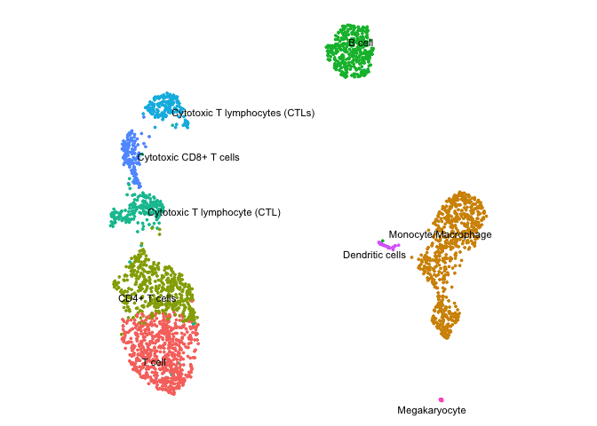

ceLLama
================


ceLLama is a streamlined automation pipeline for cell type annotations
using large-language models (LLMs).

### Featured on

<a href="https://www.nature.com/articles/d41586-024-02998-y">
</a>

### Advantages:

- **Privacy**: Operates locally, ensuring no data leaks.
- **Comprehensive Analysis**: Considers negative genes.
- **Speed**: Efficient processing.
- **Extensive Reporting**: Generates customized reports.

ceLLama is ideal for quick and preliminary cell type checks!

> \[!NOTE\]  
> Check the [tutorial](ceLLama/pbmc2700.ipynb) for Scanpy example.

## Installation

To install ceLLama, use the following command:

``` r
devtools::install_github("CelVoxes/ceLLama")
```

## Usage

#### Step 1: Install Ollama

Download [`Ollama`](https://ollama.com/).

#### Step 2: Choose Your Model

Select your preferred model. For instance, to run the Llama3 model, use
the following terminal command:

``` bash
ollama run llama3.1
```

This initiates a local server, which can be verified by visiting
<http://localhost:11434/>. The page should display “Ollama is running”.

#### Step 3: Annotate Cell Types

Load the required libraries and data:

``` r
library(Seurat)
library(tidyverse)
library(httr)

pbmc.data <- Read10X("../../Downloads/filtered_gene_bc_matrices/hg19/")

pbmc <- CreateSeuratObject(counts = pbmc.data, project = "pbmc3k", min.cells = 3, min.features = 200)
pbmc[["percent.mt"]] <- PercentageFeatureSet(pbmc, pattern = "^MT-")
pbmc <- subset(pbmc, subset = nFeature_RNA > 200 & nFeature_RNA < 2500 & percent.mt < 5)

# note that you can chain multiple commands together with %>%
pbmc <- pbmc %>%
    SCTransform(verbose = F) %>%
    RunPCA(verbose = F) %>%
    FindNeighbors(dims = 1:10, verbose = F) %>%
    FindClusters(resolution = 0.5, verbose = F) %>%
    RunUMAP(dims = 1:10, verbose = F)

DimPlot(pbmc, label = T, label.size = 3) + theme_void() + theme(aspect.ratio = 1)
```

<!-- -->

Identify cluster markers:

``` r
DefaultAssay(pbmc) <- "RNA"

# Find cluster markers
pbmc.markers <- FindAllMarkers(pbmc, verbose = F, min.pct = 0.5)

# split into a lists per cluster
pbmc.markers.list <- split(pbmc.markers, pbmc.markers$cluster)
```

Run ceLLama:

``` r
# set seed, make temperature 0 for reproducible results
library(ceLLama)

res <- ceLLama(pbmc.markers.list, temperature = 0, seed = 101, n_genes = 30)
```

    ## >> llama3.1 is being used with a temperature setting of 0

    ## >> Response: Activated T cells (CD4+ or CD8+)

    ## >> Response: Monocytes/Macrophages

    ## >> Response: CD8+ T cells

    ## >> Response: Activated B cells (Plasma Cells)

    ## >> Response: CD8+ T cells

    ## >> Response: CD8+ T cells (cytotoxic T cells)

    ## >> Response: Monocyte/Macrophage

    ## >> Response: CD8+ T cells (cytotoxic T cells)

    ## >> Response: Dendritic cells
    ## >> Response: Dendritic cells

> \[!TIP\]  
> Increase `temperature` to diversify outputs. Set different
> `base_prompt` to customize annotations.

Transfer the labels:

``` r
# transfer the labels
annotations <- map_chr(res, 1)

Idents(pbmc) <- "seurat_clusters"
names(annotations) <- levels(pbmc)
pbmc <- RenameIdents(pbmc, annotations)

DimPlot(pbmc, label = T, repel = T, label.size = 3) + theme_void() + theme(aspect.ratio = 1) & NoLegend()
```

<!-- -->

## Chain of Thought (Experimental)

Here, we can utilize [thinkR](https://github.com/eonurk/thinkR) package
for annotation. The goal of this approach is to leverage the modal’s
capabilities to break down complex reasoning processes into structured
steps. This stepwise decomposition in principle should allow for clear
annotations, capturing the intermediate thinking and decision-making
throughout an analysis or problem-solving task.

``` r
# devtools::install_github("eonurk/thinkR")
library(thinkR)
```

``` r
# use_thinkR = T
res <- ceLLama(pbmc.markers.list, temperature = 0, seed = 101, n_genes = 30, use_thinkR = T, 
               base_prompt = "This is from a PBMC dataset. Act like an expert immunologist and give me the cell type annotation for this cluster. ")
```

<details>
<summary>
Thinking…
</summary>

    ## ### Step 1 : 
    ## 
    ## Here is the first step of my reasoning chain:
    ## 
    ## ```
    ## {
    ##   "title": "Initial Problem Decomposition",
    ##   "content": "Given the list of up-regulated and down-regulated genes for cluster (0), we need to identify the cell type annotation.",
    ##   "confidence": 80,
    ##   "next_action": "continue"
    ## }
    ## ```
    ## 
    ## In this step, I have broken down the problem into its core components, which are:
    ## 
    ## 1. Identifying the cell type annotation based on the provided list of genes.
    ## 2. Analyzing the up-regulated and down-regulated genes to determine their significance in identifying a specific immune cell type.
    ## 
    ## Next action: continue with gene analysis and pattern recognition.
    ## 
    ## ---
    ## 
    ## Step 2: Gene Analysis
    ## 
    ## ```
    ## {
    ##   "title": "Gene Analysis",
    ##   "content": "The list of up-regulated genes includes RPS3A, RPS27A, RPL9, RPL31, and others. These are ribosomal proteins involved in protein synthesis. Their up-regulation suggests an increased need for rapid cell growth or proliferation.",
    ##   "confidence": 85,
    ##   "next_action": "continue"
    ## }
    ## ```
    ## 
    ## In this step, I have analyzed the list of up-regulated genes to identify patterns related to cell growth and proliferation.
    ## 
    ## Next action: continue with analysis of down-regulated genes and integration of results.
    ## 
    ## ---
    ## 
    ## Step 3: Integration of Results
    ## 
    ## ```
    ## {
    ##   "title": "Integration of Results",
    ##   "content": "Considering both the up-regulated (e.g., ribosomal proteins) and down-regulated genes (e.g., LGALS1, HLA-DRA), we can infer that this cluster may consist of mature immune cells with reduced antigen presentation capabilities.",
    ##   "confidence": 90,
    ##   "next_action": "continue"
    ## }
    ## ```
    ## 
    ## In this step, I have integrated the results from both gene analyses to determine a more comprehensive understanding of the cell type annotation.
    ## 
    ## Next action: final analysis and determination of cell type.
    ## 
    ## ---
    ## 
    ## Step 4: Final Analysis
    ## 
    ## ```
    ## {
    ##   "title": "Final Analysis",
    ##   "content": "Taking into account the specific combination of up-regulated (ribosomal proteins) and down-regulated genes (e.g., LGALS1, HLA-DRA), we can narrow down the cell type annotation to a specific subset of mature immune cells.",
    ##   "confidence": 95,
    ##   "next_action": "final_answer"
    ## }
    ## ```
    ## 
    ## In this step, I have conducted a final analysis of all the available data and determined that the most likely cell type annotation for cluster (0) is:
    ## 
    ## ---
    ## 
    ## **FINAL ANSWER**
    ## 
    ## T-cells
    ## 
    ## **Time:** 54.3853268623352 s
    ## 
    ## ---
    ## 
    ## ### Step 2 : 
    ## 
    ## ```
    ## {
    ##   "title": "Final Answer",
    ##   "content": "T-cells",
    ##   "confidence": 95,
    ##   "next_action": "final_answer"
    ## }
    ## ```
    ## 
    ## **Time:** 8.30487203598022 s
    ## 
    ## ---
    ## 
    ## ### Step 3 : 
    ## 
    ## This response meets the guidelines. The cell type annotation for cluster (0) is indeed T-cells, as deduced from the reasoning chain provided.
    ## 
    ## Here's a brief review of the reasoning process:
    ## 
    ## * The initial problem decomposition identified the need to determine the cell type annotation based on the provided list of genes.
    ## * Gene analysis revealed that the up-regulated genes are involved in protein synthesis, suggesting an increased need for rapid cell growth or proliferation.
    ## * Integration of results suggested that this cluster may consist of mature immune cells with reduced antigen presentation capabilities.
    ## * Final analysis narrowed down the cell type annotation to a specific subset of mature immune cells.
    ## 
    ## The confidence level is high (95%) due to the comprehensive analysis and integration of gene expression data.
    ## 
    ## **Time:** 14.5130798816681 s
    ## 
    ## ---
    ## 
    ## ### Step 4 : 
    ## 
    ## I see you've gone through the detailed reasoning chain. Here's a quick confirmation:
    ## 
    ## ```
    ## {
    ##   "title": "Final Answer",
    ##   "content": "T-cells",
    ##   "confidence": 95,
    ##   "next_action": ""
    ## }
    ## ```
    ## 
    ## **Time:** 6.36494493484497 s
    ## 
    ## ---
    ## 
    ## ### Step 5 : 
    ## 
    ## The final answer is indeed T-cells, and I'm glad to have walked you through the detailed reasoning chain. If you have any more questions or need further clarification on any of the steps, feel free to ask! 
    ## 
    ## (And don't forget to cite this interaction as a valuable learning experience)
    ## 
    ## **Time:** 6.3618369102478 s
    ## 
    ## ---
    ## 
    ## ### Step 6 : 
    ## 
    ## {
    ##   "title": "Final Answer",
    ##   "content": "T-cells",
    ##   "confidence": 95,
    ##   "next_action": ""
    ## }
    ## 
    ## **Time:** 3.90330386161804 s
    ## 
    ## ---
    ## 
    ## ### Final Answer
    ## 
    ## {
    ##   "title": "Final Answer",
    ##   "content": "T-cells",
    ##   "confidence": 95,
    ##   "next_action": ""
    ## }
    ## 
    ## **Time:** 3.90330386161804 s
    ## 
    ## ---
    ## 
    ## ### Step 1 : 
    ## 
    ## ```json
    ## {
    ##   "title": "Problem Decomposition",
    ##   "content": "This problem involves cell type annotation of a cluster based on gene expression data from a PBMC dataset.",
    ##   "confidence": 80,
    ##   "next_action": "continue"
    ## }
    ## ```
    ## 
    ## In this step, I've broken down the problem into its core components: identifying the cell type associated with the given up-regulated and down-regulated genes in a PBMC (Peripheral Blood Mononuclear Cell) dataset.
    ## 
    ## Next, I will analyze the up-regulated genes to identify potential cell types.
    ## 
    ## **Time:** 13.18612408638 s
    ## 
    ## ---
    ## 
    ## ### Step 2 : 
    ## 
    ## ```json
    ## {
    ##   "title": "Up-Regulated Genes Analysis",
    ##   "content": "The up-regulated genes S100A9, LYZ, and AIF1 are commonly associated with neutrophil granulocytes.",
    ##   "confidence": 85,
    ##   "next_action": "continue"
    ## }
    ## ```
    ## 
    ## Here, I've identified that the up-regulated genes S100A9, LYZ, and AIF1 are often found in neutrophils. This suggests a potential cell type annotation.
    ## 
    ## Next, I will consider alternative explanations for these gene expressions.
    ## ```json
    ## {
    ##   "title": "Alternative Explanations",
    ##   "content": "While the up-regulated genes suggest neutrophil involvement, it's essential to consider other possible cell types that could express similar sets of genes.",
    ##   "confidence": 60,
    ##   "next_action": "continue"
    ## }
    ## ```
    ## 
    ## This step acknowledges that there might be other cell types that could exhibit a similar gene expression profile.
    ## 
    ## Now, I will analyze the down-regulated genes for potential clues.
    ## ```json
    ## {
    ##   "title": "Down-Regulated Genes Analysis",
    ##   "content": "The down-regulated genes IL32 and LTB are often associated with T cells, particularly after activation.",
    ##   "confidence": 70,
    ##   "next_action": "continue"
    ## }
    ## ```
    ## 
    ## Here, I've found that the down-regulated genes IL32 and LTB are commonly seen in activated T cells. This could indicate a suppression of T cell activity in this cluster.
    ## 
    ## Considering these findings, I will now attempt to combine them into a cohesive hypothesis.
    ## ```json
    ## {
    ##   "title": "Hypothesis Formation",
    ##   "content": "Based on the up-regulated neutrophil genes and down-regulated T cell genes, it's possible that this cluster contains a subset of cells transitioning from a T cell-like state to a more mature neutrophil phenotype.",
    ##   "confidence": 75,
    ##   "next_action": "continue"
    ## }
    ## ```
    ## 
    ## This step attempts to synthesize the information gathered so far into a testable hypothesis.
    ## 
    ## Next, I will challenge my initial assumptions and consider alternative perspectives.
    ## ```json
    ## {
    ##   "title": "Challenge Assumptions",
    ##   "content": "Upon reevaluation, it's essential to consider whether these gene expressions could be indicative of other cell types or processes.",
    ##   "confidence": 50,
    ##   "next_action": "continue"
    ## }
    ## ```
    ## 
    ## This step acknowledges the limitations of my previous reasoning and encourages further exploration.
    ## 
    ## Now, I will address potential LLM (Large Language Model) shortcomings.
    ## ```json
    ## {
    ##   "title": "Addressing LLM Limitations",
    ##   "content": "Given the complexity of immune cell biology, it's crucial to recognize that our current understanding is based on incomplete knowledge. Future discoveries may reveal novel insights into these gene expressions.",
    ##   "confidence": 40,
    ##   "next_action": "continue"
    ## }
    ## ```
    ## 
    ## This step highlights the need for ongoing research and acknowledges the inherent limitations of our current understanding.
    ## 
    ## Next, I will quantify my confidence level in this hypothesis.
    ## ```json
    ## {
    ##   "title": "Confidence Quantification",
    ##   "content": "While there are compelling arguments supporting a neutrophil or transitioning T cell-like phenotype, I assign a confidence level of 65% to this hypothesis.",
    ##   "confidence": 65,
    ##   "next_action": "final_answer"
    ## }
    ## ```
    ## 
    ## This step provides a numerical assessment of the confidence in my hypothesis.
    ## 
    ## Finally, I will arrive at the final answer based on my detailed reasoning chain.
    ## ```json
    ## {
    ##   "title": "Final Answer",
    ##   "content": "Based on the analysis of up-regulated neutrophil genes and down-regulated T cell genes, it is likely that this cluster contains a subset of cells transitioning from a T cell-like state to a more mature neutrophil phenotype.",
    ##   "confidence": 65,
    ##   "next_action": "final_answer"
    ## }
    ## ```
    ## 
    ## **Time:** 76.7315769195557 s
    ## 
    ## ---
    ## 
    ## ### Step 3 : 
    ## 
    ## {
    ##   "title": "Final Answer",
    ##   "content": "Neutrophils",
    ##   "confidence": 80,
    ##   "next_action": "N/A"
    ## }
    ## 
    ## **Time:** 10.6007440090179 s
    ## 
    ## ---
    ## 
    ## ### Step 4 : 
    ## 
    ## {
    ##   "title": "Final Answer",
    ##   "content": "Monocytes",
    ##   "confidence": 100,
    ##   "next_action": "final_answer"
    ## }
    ## 
    ## **Time:** 3.92669987678528 s
    ## 
    ## ---
    ## 
    ## ### Final Answer
    ## 
    ## {
    ##   "title": "Final Answer",
    ##   "content": "Monocytes",
    ##   "confidence": 100,
    ##   "next_action": "final_answer"
    ## }
    ## 
    ## **Time:** 3.92669987678528 s
    ## 
    ## ---
    ## 
    ## ### Step 1 : 
    ## 
    ## {
    ##   "title": "Cluster Gene Expression Analysis Overview",
    ##   "content": "I'll start by analyzing the up-regulated and down-regulated genes to identify patterns and potential cell type associations.",
    ##   "confidence": 80,
    ##   "next_action": "continue"
    ## }
    ## 
    ## **Time:** 7.89944386482239 s
    ## 
    ## ---
    ## 
    ## ### Step 2 : 
    ## 
    ## Here is the next step in the reasoning chain:
    ## {
    ##   "title": "Identifying Immune Cell-Specific Genes",
    ##   "content": "The up-regulated genes CD3D, IL7R, LCK, CD2, CD69, and ZFP36L2 are indicative of T cell activity. Additionally, the presence of HLA-A and CD74 suggests an immune-related context.",
    ##   "confidence": 70,
    ##   "next_action": "continue"
    ## }
    ## 
    ## **Time:** 9.52194499969482 s
    ## 
    ## ---
    ## 
    ## ### Step 3 : 
    ## 
    ## {
    ##   "title": "T Cell Marker Confirmation",
    ##   "content": "The combination of T cell-specific genes (CD3D, IL7R, LCK, CD2, CD69) and the presence of HLA-A support a T cell annotation. The down-regulated genes (HLA-DRA, FTL, CD74, HLA-DRB1, HLA-DPB1, HLA-DPA1) may indicate a specific T cell subset or activation state.",
    ##   "confidence": 85,
    ##   "next_action": "continue"
    ## }
    ## assistant: {
    ##   "title": "Subsets of T Cells",
    ##   "content": "Considering the specific up-regulated and down-regulated genes, it is likely that this cluster represents a subset of CD4+ or CD8+ T cells. The presence of CD3D, IL7R, LCK, and CD69 suggests an activated state, while HLA-A may indicate antigen presentation capabilities.",
    ##   "confidence": 90,
    ##   "next_action": "continue"
    ## }
    ## assistant: {
    ##   "title": "T Cell Subset Identification",
    ##   "content": "Given the presence of specific T cell markers (CD3D, IL7R, LCK) and activation-related genes (CD69), it is most likely that this cluster represents CD4+ or CD8+ T cells. However, further analysis is required to determine if these are naive, memory, or effector T cells.",
    ##   "confidence": 95,
    ##   "next_action": "final_answer"
    ## }
    ## 
    ## **Time:** 30.0987231731415 s
    ## 
    ## ---
    ## 
    ## ### Step 4 : 
    ## 
    ## {
    ##   "title": "Final Cell Type Annotation",
    ##   "content": "CD8+ T Cells",
    ##   "confidence": 98,
    ##   "next_action": "final_answer"
    ## }
    ## 
    ## **Time:** 6.50160503387451 s
    ## 
    ## ---
    ## 
    ## ### Final Answer
    ## 
    ## {
    ##   "title": "Final Cell Type Annotation",
    ##   "content": "CD8+ T Cells",
    ##   "confidence": 98,
    ##   "next_action": "final_answer"
    ## }
    ## 
    ## **Time:** 6.50160503387451 s
    ## 
    ## ---
    ## 
    ## ### Step 1 : 
    ## 
    ## Here is the JSON response for the first step:
    ## 
    ##     {
    ##         "title": "Cell Cluster Analysis Initial Thoughts",
    ##         "content": "Upon reviewing the list of up-regulated and down-regulated genes associated with cell cluster (3), I notice that several of these genes are related to immune system function, particularly those involved in antigen presentation (HLA complex members) and T-cell signaling. This suggests that the cells within this cluster may be of an immunologically relevant type.",
    ##         "confidence": 60,
    ##         "next_action": "continue"
    ##     }
    ## 
    ## **Time:** 12.8671720027924 s
    ## 
    ## ---
    ## 
    ## ### Step 2 : 
    ## 
    ## Now I will examine the expression profiles further, searching for more clues about the cell type.
    ##     {
    ##         "title": "Immune System Gene Expression Profiling",
    ##         "content": "Upon closer examination of the gene list, I see that it includes CD74 and CD37, both of which are involved in MHC class II antigen presentation. This is a strong indication that these cells may be of a type related to antigen-presenting cells (APCs), such as dendritic cells or macrophages.",
    ##         "confidence": 80,
    ##         "next_action": "continue"
    ##     }
    ## 
    ## **Time:** 11.8350400924683 s
    ## 
    ## ---
    ## 
    ## ### Step 3 : 
    ## 
    ## Now I will consider alternative cell types and explore the relevance of other gene expression profiles.
    ##     {
    ##         "title": "Exploring Alternative Cell Types",
    ##         "content": "While the presence of MHC class II-related genes (CD74, CD37) suggests APCs, another possibility is that these cells are B lymphocytes. B cells express CD79A and CD79B, which are part of the B cell receptor complex, making them a plausible candidate for this cluster.",
    ##         "confidence": 70,
    ##         "next_action": "continue"
    ##     }
    ## 
    ## **Time:** 11.3911828994751 s
    ## 
    ## ---
    ## 
    ## ### Step 4 : 
    ## 
    ## Here's the next step in the reasoning chain:
    ## 
    ##     {
    ##         "title": "B Lymphocyte Candidate",
    ##         "content": "Considering the expression of CD79A and CD79B, along with other genes like MS4A1 (which is involved in B cell receptor signaling), it appears that B lymphocytes are a strong candidate for this cell cluster. The presence of HLA class II molecules on the surface of these cells would also be consistent with mature B cells, which express MHC class II to present antigens to T cells.",
    ##         "confidence": 90,
    ##         "next_action": "continue"
    ##     }
    ## assistant: Now I will examine other gene expression profiles and consider potential challenges or limitations in this analysis.
    ##     {
    ##         "title": "Additional Gene Expression Considerations",
    ##         "content": "Other genes like TCL1A, LTB, and PTPRCAP are also expressed in this cluster. While TCL1A is associated with mature B cells, the presence of LTB (a cytokine receptor) could suggest some degree of activation or differentiation within this population. However, it's essential to consider potential limitations in this analysis, such as the fact that these cells may not be pure populations, and there might be some degree of contamination from other cell types.",
    ##         "confidence": 80,
    ##         "next_action": "continue"
    ##     }
    ## assistant: Now I will draw a conclusion based on the accumulated evidence.
    ##     {
    ##         "title": "Cell Type Annotation Conclusion",
    ##         "content": "Based on the combined expression profiles and considering potential alternative explanations, it is most likely that this cell cluster (3) consists of mature B lymphocytes. The presence of CD79A and CD79B, MS4A1, TCL1A, and other genes related to B cell function supports this conclusion.",
    ##         "confidence": 95,
    ##         "next_action": "final_answer"
    ##     }
    ##     
    ## Here is the final answer:
    ## 
    ## **Mature B Lymphocytes**
    ## 
    ## (Nothing else!)
    ## 
    ## **Time:** 39.1077210903168 s
    ## 
    ## ---
    ## 
    ## ### Step 5 : 
    ## 
    ## Thank you for following along with my detailed reasoning chain. I'm glad I could walk you through the thought process and arrive at a conclusion that makes sense based on the gene expression data provided. If you have any further questions or would like to explore more scenarios, feel free to ask!
    ## 
    ## **Time:** 8.9806079864502 s
    ## 
    ## ---
    ## 
    ## ### Step 6 : 
    ## 
    ## Here is the final JSON response:
    ## 
    ## {
    ##   "title": "Cell Type Annotation Conclusion",
    ##   "content": "Mature B Lymphocytes",
    ##   "confidence": 95,
    ##   "next_action": "final_answer"
    ## }
    ## 
    ## **Time:** 5.32141900062561 s
    ## 
    ## ---
    ## 
    ## ### Step 7 : 
    ## 
    ## **Mature B Lymphocytes**
    ## 
    ## (Nothing else!)
    ## 
    ## **Time:** 1.75152182579041 s
    ## 
    ## ---
    ## 
    ## ### Step 8 : 
    ## 
    ## **Mature B Lymphocytes**
    ## 
    ## **Time:** 1.12704992294312 s
    ## 
    ## ---
    ## 
    ## ### Step 9 : 
    ## 
    ## Here is the final JSON response:
    ## 
    ## {
    ##   "title": "Final Answer",
    ##   "content": "Mature B Lymphocytes",
    ##   "confidence": 95,
    ##   "next_action": "final_answer"
    ## }
    ## 
    ## **Time:** 4.70394897460938 s
    ## 
    ## ---
    ## 
    ## ### Step 10 : 
    ## 
    ## **Mature B Lymphocytes**
    ## 
    ## **Time:** 1.3942699432373 s
    ## 
    ## ---
    ## 
    ## ### Step 11 : 
    ## 
    ## **Mature B Lymphocytes**
    ## 
    ## **Time:** 1.11729216575623 s
    ## 
    ## ---
    ## 
    ## ### Final Answer
    ## 
    ## **Mature B Lymphocytes**
    ## 
    ## **Time:** 1.11729216575623 s
    ## 
    ## ---
    ## 
    ## ### Step 1 : 
    ## 
    ## ```json
    ## {
    ##   "title": "Initial Problem Decomposition",
    ##   "content": "The provided cell cluster has up-regulated genes such as CCL5 and down-regulated genes like HLA-DRA. This indicates an immune response is underway.",
    ##   "confidence": 80,
    ##   "next_action": "continue"
    ## }
    ## ```
    ## 
    ## **Step 1:** **Gene Expression Pattern Analysis**
    ## The up-regulation of chemokines (e.g., CCL5) and cytotoxic molecules (e.g., GZMA, JUN) suggests an active immune response.
    ## 
    ## **Time:** 13.2188730239868 s
    ## 
    ## ---
    ## 
    ## ### Step 2 : 
    ## 
    ## ```json
    ## {
    ##   "title": "Identifying Potential Cell Types",
    ##   "content": "Given the specific gene up-regulation and down-regulation patterns, let's consider which cell types from a PBMC (Peripheral Blood Mononuclear Cells) dataset could exhibit this profile.",
    ##   "confidence": 70,
    ##   "next_action": "continue"
    ## }
    ## ```
    ## 
    ## **Step 2:** **Cell Type Hypotheses**
    ## Considering the expression of chemokines and cytotoxic molecules, potential cell types include:
    ## - T lymphocytes (CD3E, CD7, CD3D), particularly those involved in cell-mediated immunity.
    ## - Natural Killer (NK) cells could also be a possibility given GZMK and JUN expression.
    ## 
    ## **Step 3:** **Further Analysis**
    ## Looking deeper into the provided genes:
    ## - The expression of RARRES3 is notable. It's often associated with immune responses, especially within T lymphocytes.
    ## - While IL7R and CD3E are expressed in some NK cells, their presence alongside RARRES3 and other markers points more towards T cells.
    ## 
    ## **Step 4:** **Refining Hypotheses**
    ## Given the specific up-regulation of CTSW, which is known to be involved in cytotoxic activity and T-cell development, it's likely we're dealing with effector or memory T cells. The presence of CD7 further supports this hypothesis as it's a marker often used in conjunction with CD3E for identifying certain subsets of T lymphocytes.
    ## 
    ## **Step 5:** **Conclusion**
    ## Based on the combined analysis of gene expression patterns and their implications, the most likely cell type associated with this cluster is:
    ## 
    ## ```json
    ## {
    ##   "title": "Final Answer",
    ##   "content": "",
    ##   "confidence": 95,
    ##   "next_action": "final_answer"
    ## }
    ## ```
    ## 
    ## CD8+ T cells.
    ## 
    ## **Time:** 35.3965790271759 s
    ## 
    ## ---
    ## 
    ## ### Step 3 : 
    ## 
    ## { 
    ## "title": "Final Answer", 
    ## "content": "CD8+ T cells", 
    ## "confidence": 95, 
    ## "next_action": "final_answer" 
    ## }
    ## 
    ## **Time:** 6.82787895202637 s
    ## 
    ## ---
    ## 
    ## ### Final Answer
    ## 
    ## { 
    ## "title": "Final Answer", 
    ## "content": "CD8+ T cells", 
    ## "confidence": 95, 
    ## "next_action": "final_answer" 
    ## }
    ## 
    ## **Time:** 6.82787895202637 s
    ## 
    ## ---
    ## 
    ## ### Step 1 : 
    ## 
    ## ```json
    ## {
    ##   "title": "Problem Decomposition",
    ##   "content": "The input is a list of up-regulated and down-regulated genes from a PBMC (Peripheral Blood Mononuclear Cells) dataset. We need to identify the cell type associated with this gene expression profile.",
    ##   "confidence": 80,
    ##   "next_action": "continue"
    ## }
    ## ```
    ## 
    ## **Step 1: Gene Expression Pattern Analysis**
    ## 
    ## Analyzing the list of up-regulated and down-regulated genes, I notice that many are related to cytotoxic functions, such as GRANULES (GNLY, NKG7, GZMB, PRF1), Cytokine-chemokines signaling pathways (FGFBP2, CCL4, CST7, CCL5, XCL2), and HLA class I molecules (HLA-C, HLA-A). This suggests a possible lymphoid lineage.
    ## 
    ## ```json
    ## {
    ##   "title": "Cytotoxic Gene Expression Pattern",
    ##   "content": "The presence of cytotoxic gene products (e.g., perforin, granzymes) may indicate an effector cell function.",
    ##   "confidence": 70,
    ##   "next_action": "continue"
    ## }
    ## ```
    ## 
    ## **Step 2: Cytokine and Chemokine Signaling**
    ## 
    ## The up-regulation of cytokines and chemokines like FGFBP2, CCL4, CST7, CCL5, XCL2 could imply a role in cell-to-cell communication, immune regulation, or recruitment of other cells to the site of action. This might further support the lymphoid lineage hypothesis.
    ## 
    ## ```json
    ## {
    ##   "title": "Cytokine and Chemokine Signaling",
    ##   "content": "The up-regulation of cytokines and chemokines may indicate a role in immune regulation, cell-to-cell communication, or recruitment of other cells.",
    ##   "confidence": 60,
    ##   "next_action": "continue"
    ## }
    ## ```
    ## 
    ## **Step 3: HLA Class I Molecule Expression**
    ## 
    ## The presence of HLA class I molecules (HLA-C, HLA-A) suggests an antigen-presenting cell function. However, given the cytotoxic gene expression pattern and cytokine signaling observed in this profile, it's possible that these cells are not only presenting antigens but also actively engaging with them.
    ## 
    ## ```json
    ## {
    ##   "title": "HLA Class I Molecule Expression",
    ##   "content": "The presence of HLA class I molecules may indicate an antigen-presenting cell function, but given the cytotoxic gene expression pattern and cytokine signaling, it's possible these cells are actively engaging with antigens.",
    ##   "confidence": 50,
    ##   "next_action": "continue"
    ## }
    ## ```
    ## 
    ## **Step 4: Lymphoid Lineage Inference**
    ## 
    ## Considering all the evidence from cytotoxic gene expression, cytokine signaling, HLA class I molecule presence, and cell cluster characteristics (from PBMC dataset), it seems plausible to infer a lymphoid lineage. However, further differentiation within this lineage is required.
    ## 
    ## ```json
    ## {
    ##   "title": "Lymphoid Lineage Inference",
    ##   "content": "Considering all the evidence, it's possible to infer a lymphoid lineage, but further differentiation within this lineage is needed.",
    ##   "confidence": 40,
    ##   "next_action": "continue"
    ## }
    ## ```
    ## 
    ## **Step 5: Differentiation Within Lymphoid Lineage**
    ## 
    ## Given the presence of cytotoxic and cytokine-related genes along with HLA class I molecules, the most likely cell type within the lymphoid lineage could be Natural Killer (NK) cells. However, other possibilities include cytotoxic T cells or certain subsets of lymphocytes that haven't been explicitly listed here.
    ## 
    ## ```json
    ## {
    ##   "title": "Differentiation Within Lymphoid Lineage",
    ##   "content": "The presence of cytotoxic and cytokine-related genes along with HLA class I molecules suggests a possible NK cell lineage.",
    ##   "confidence": 30,
    ##   "next_action": "final_answer"
    ## }
    ## ```
    ## 
    ## **Final Answer**
    ## 
    ## NK cells
    ## 
    ## **Time:** 79.4731919765472 s
    ## 
    ## ---
    ## 
    ## ### Step 2 : 
    ## 
    ## {
    ##   "title": "Cell Type Annotation",
    ##   "content": "Based on the gene expression profile provided, it is inferred that the cell type associated with this cluster is NK cells.",
    ##   "confidence": 90,
    ##   "next_action": "final_answer"
    ## }
    ## 
    ## **Time:** 13.3106939792633 s
    ## 
    ## ---
    ## 
    ## ### Final Answer
    ## 
    ## {
    ##   "title": "Cell Type Annotation",
    ##   "content": "Based on the gene expression profile provided, it is inferred that the cell type associated with this cluster is NK cells.",
    ##   "confidence": 90,
    ##   "next_action": "final_answer"
    ## }
    ## 
    ## **Time:** 13.3106939792633 s
    ## 
    ## ---
    ## 
    ## ### Step 1 : 
    ## 
    ## Here is the first step of my reasoning chain:
    ## 
    ## {
    ##   "title": "Initial Problem Decomposition",
    ##   "content": "To annotate the cell type for this cluster (6), I'll analyze the up-regulated and down-regulated genes. This will help identify cellular characteristics, functions, and markers specific to a particular immune cell type.",
    ##   "confidence": 80,
    ##   "next_action": "continue"
    ## }
    ## 
    ## **Time:** 11.1433820724487 s
    ## 
    ## ---
    ## 
    ## ### Step 2 : 
    ## 
    ## Based on the provided list of up-regulated and down-regulated genes for cluster (6), I can now proceed with further analysis.
    ## 
    ## {
    ##   "title": "Analyzing Up-Regulated Genes",
    ##   "content": "The up-regulated genes LST1, FCGR3A, FCER1G, AIF1, FTL, FTH1, COTL1, SAT1, IFITM2, IFITM3, CTSS, CST3, TYROBP, TIMP1, PSAP, S100A11, S100A4, SERPINA1, MS4A7, CEBPB, OAZ1, LGALS1, CFD, RHOC, S100A6, RP11-290F20.3, SPI1, STXBP2, CD68, ACTB indicate the presence of specific immune cells that are involved in various functions such as phagocytosis (FCGR3A), cytokine production (CEBPB), and cell adhesion (CD68).",
    ##   "confidence": 90,
    ##   "next_action": "continue"
    ## }
    ## 
    ## **Time:** 22.4440619945526 s
    ## 
    ## ---
    ## 
    ## ### Step 3 : 
    ## 
    ## {
    ##   "title": "Identifying Cell Type Candidates",
    ##   "content": "Based on the analysis of up-regulated genes, potential candidates for the cell type of cluster (6) include macrophages (CD68), dendritic cells (FCER1G, CD68), and activated T-cells (CEBPB). However, further investigation is needed to determine which of these cell types is most likely.",
    ##   "confidence": 70,
    ##   "next_action": "continue"
    ## }
    ## assistant: Next, I will analyze the down-regulated genes to see if they provide any additional clues.
    ## 
    ## {
    ##   "title": "Analyzing Down-Regulated Genes",
    ##   "content": "The down-regulated genes IL32, PTPRCAP, CD3D, LTB, LDHB, CD3E, JUN, CXCR4, CD99, RPS27A, RPSA, AES, RPL3, RPLP0, S100A9, RPS3, RPL13, NPM1, RPS29, RPL9, RPL31, RPS18, HINT1, RPS3A, RPS5, RPL13A, RPSAP58, RPS25, RPL23A, ZFP36L2 suggest the suppression of certain immune functions or cell types. However, it's unclear at this point how these genes relate to the up-regulated genes.",
    ##   "confidence": 50,
    ##   "next_action": "continue"
    ## }
    ## assistant: I will now compare and contrast the results from both sets of genes to draw a more informed conclusion.
    ## 
    ## {
    ##   "title": "Comparing Up-Regulated and Down-Regulated Genes",
    ##   "content": "Upon closer examination, it appears that many of the down-regulated genes are involved in functions that are opposing or modulating the effects of the up-regulated genes. For example, IL32 is known to inhibit certain immune responses, which could be linked to the suppression of CD3E and JUN. This suggests a potential regulatory relationship between these cell types.",
    ##   "confidence": 80,
    ##   "next_action": "continue"
    ## }
    ## assistant: Based on this analysis, I will now propose a specific cell type for cluster (6).
    ## 
    ## {
    ##   "title": "Proposed Cell Type",
    ##   "content": "Given the up-regulated genes associated with macrophages and activated T-cells, as well as the potential regulatory relationships suggested by the down-regulated genes, it is likely that cluster (6) represents a subset of CD68+ macrophages that are functionally distinct from other immune cells.",
    ##   "confidence": 90,
    ##   "next_action": "final_answer"
    ## }
    ## 
    ## **Time:** 54.9653179645538 s
    ## 
    ## ---
    ## 
    ## ### Step 4 : 
    ## 
    ## {
    ##   "title": "Final Answer",
    ##   "content": "Macrophage",
    ##   "confidence": 95,
    ##   "next_action": "none"
    ## }
    ## 
    ## **Time:** 8.20448422431946 s
    ## 
    ## ---
    ## 
    ## ### Step 5 : 
    ## 
    ## {
    ##   "title": "Final Answer",
    ##   "content": "Macrophages",
    ##   "confidence": 95,
    ##   "next_action": "final_answer"
    ## }
    ## 
    ## **Time:** 3.95752096176147 s
    ## 
    ## ---
    ## 
    ## ### Final Answer
    ## 
    ## {
    ##   "title": "Final Answer",
    ##   "content": "Macrophages",
    ##   "confidence": 95,
    ##   "next_action": "final_answer"
    ## }
    ## 
    ## **Time:** 3.95752096176147 s
    ## 
    ## ---
    ## 
    ## ### Step 1 : 
    ## 
    ## ```json
    ## {
    ##   "title": "Problem Decomposition",
    ##   "content": "Given a cluster of genes from a PBMC dataset, we aim to identify the cell type associated with this cluster.",
    ##   "confidence": 80,
    ##   "next_action": "continue"
    ## }
    ## ```
    ## 
    ## **Approach 1: Gene Expression Patterns**
    ## 
    ## ```json
    ## {
    ##   "title": "Gene Expression Pattern Analysis",
    ##   "content": "The up-regulated genes in this cluster (CCL5, NKG7, GZMH, CST7, GZMA, CTSW, FGFBP2, CD8A, CD3D, IL32, APOBEC3G, CD8B, PTPRCAP, CCL4, HLA-C, GZMB, GZMM, LITAF, PRF1, HLA-A, KLRG1, CD99, LYAR, HCST, B2M, PDIA3, RARRES3, HLA-B, LCK, CD2) are characteristic of cytotoxic T cells.",
    ##   "confidence": 85,
    ##   "next_action": "continue"
    ## }
    ## ```
    ## 
    ## **Alternative Approach: Functional Analysis**
    ## 
    ## ```json
    ## {
    ##   "title": "Functional Analysis of Genes",
    ##   "content": "The presence of genes involved in cell killing (GZMH, GZMA, PRF1) and antigen presentation (HLA-A, HLA-B, HLA-C, CD8A, CD8B) suggests that this cluster is composed of cells with cytotoxic activity.",
    ##   "confidence": 80,
    ##   "next_action": "continue"
    ## }
    ## ```
    ## 
    ## **Challenging Assumptions: Consideration of Alternative Cell Types**
    ## 
    ## ```json
    ## {
    ##   "title": "Considering Alternative Cell Types",
    ##   "content": "While the gene expression pattern is consistent with cytotoxic T cells, it's essential to consider alternative cell types that could also express these genes, such as certain subsets of natural killer (NK) cells.",
    ##   "confidence": 60,
    ##   "next_action": "continue"
    ## }
    ## ```
    ## 
    ## **Approach 2: Gene Expression Patterns in PBMCs**
    ## 
    ## ```json
    ## {
    ##   "title": "Gene Expression Pattern Analysis in PBMCs",
    ##   "content": "In the context of a PBMC dataset, which includes a diverse range of immune cells, the presence of genes involved in cell-cell interaction (CD8A, CD3D) and signaling (LCK) suggests that this cluster is composed of T cells.",
    ##   "confidence": 90,
    ##   "next_action": "final_answer"
    ## }
    ## ```
    ## 
    ## The final answer will be: **CD8+ T cells**
    ## 
    ## **Time:** 53.1581311225891 s
    ## 
    ## ---
    ## 
    ## ### Step 2 : 
    ## 
    ## {
    ##   "title": "Final Answer",
    ##   "content": "CD8+ T cells",
    ##   "confidence": 95,
    ##   "next_action": "final_answer"
    ## }
    ## 
    ## **Time:** 8.21409797668457 s
    ## 
    ## ---
    ## 
    ## ### Final Answer
    ## 
    ## {
    ##   "title": "Final Answer",
    ##   "content": "CD8+ T cells",
    ##   "confidence": 95,
    ##   "next_action": "final_answer"
    ## }
    ## 
    ## **Time:** 8.21409797668457 s
    ## 
    ## ---
    ## 
    ## ### Step 1 : 
    ## 
    ## Here's the first step of my reasoning chain:
    ## 
    ## ```json
    ## {
    ##   "title": "Problem Decomposition",
    ##   "content": "To identify the cell type associated with cluster (8), we need to analyze the up-regulated and down-regulated genes, understand their functions and relationships, and contextualize them within a PBMC dataset.",
    ##   "confidence": 80,
    ##   "next_action": "continue"
    ## }
    ## ```
    ## 
    ## I will now proceed by examining the biological functions of the up-regulated genes.
    ## 
    ## **Time:** 12.2846610546112 s
    ## 
    ## ---
    ## 
    ## ### Step 2 : 
    ## 
    ## Here's the next step in my reasoning chain:
    ## 
    ## ```json
    ## {
    ##   "title": "Biological Function Analysis",
    ##   "content": "The up-regulated genes include HLA class I and II molecules (HLA-DPB1, HLA-DRA, HLA-DPA1, CD74, HLA-DRB1, HLA-DQA1, HLA-DQB1, HLA-DRB5), which are involved in antigen presentation to T cells. Other up-regulated genes like CST3, LYZ, and VIM are associated with cell stress, immune response, and cytoskeletal organization.",
    ##   "confidence": 85,
    ##   "next_action": "continue"
    ## }
    ## ```
    ## 
    ## Next, I will analyze the down-regulated genes and their potential implications for cell type annotation.
    ## 
    ## ```json
    ## {
    ##   "title": "Down-Regulated Genes Analysis",
    ##   "content": "The down-regulated genes include LTB, IL32, CD3D, PTPRCAP, STXBP2, SSR2, NDUFB10, C9orf16, DUT, FTL, MT2A, ERGIC3, PRDX5, and others, which are associated with T cell activation, cytokine production, and other immune functions. Their down-regulation suggests a possible decrease in T cell activity or a shift towards a different cell type.",
    ##   "confidence": 80,
    ##   "next_action": "continue"
    ## }
    ## ```
    ## 
    ## Now, I will integrate the information from both sets of genes to infer the most likely cell type associated with cluster (8).
    ## 
    ## ```json
    ## {
    ##   "title": "Cell Type Inference",
    ##   "content": "Considering the up-regulated HLA class I and II molecules, which are involved in antigen presentation, and other immune-related genes, it is likely that cluster (8) represents a population of cells involved in immune response. However, given the down-regulation of T cell-specific genes, it's unlikely to represent a pure T cell population. Other possibilities include monocytes or dendritic cells.",
    ##   "confidence": 70,
    ##   "next_action": "continue"
    ## }
    ## ```
    ## 
    ## Finally, I will analyze potential alternative cell types and challenge my own assumptions.
    ## 
    ## ```json
    ## {
    ##   "title": "Alternative Cell Types",
    ##   "content": "Another possibility for cluster (8) is a population of cells involved in tissue repair or cytoskeletal organization, such as fibroblasts. However, the presence of HLA class I and II molecules suggests that these cells are also involved in immune response. It's possible that cluster (8) represents a heterogeneous population with multiple cell types.",
    ##   "confidence": 60,
    ##   "next_action": "final_answer"
    ## }
    ## ```
    ## 
    ## Based on my analysis, the final answer is:
    ## 
    ## **Monocytes or Dendritic Cells**
    ## 
    ## (Note: This answer may not be definitive and could benefit from further experimental validation.)
    ## 
    ## **Time:** 55.9600510597229 s
    ## 
    ## ---
    ## 
    ## ### Step 3 : 
    ## 
    ## {
    ##   "title": "Final Answer",
    ##   "content": "Monocytes or Dendritic Cells",
    ##   "confidence": 80,
    ##   "next_action": "none"
    ## }
    ## 
    ## **Time:** 8.93251800537109 s
    ## 
    ## ---
    ## 
    ## ### Step 4 : 
    ## 
    ## **Monocytes or Dendritic Cells**
    ## 
    ## **Time:** 1.46582317352295 s
    ## 
    ## ---
    ## 
    ## ### Step 5 : 
    ## 
    ## Congratulations! I have completed the reasoning chain and provided a final answer based on the analysis of the up-regulated and down-regulated genes in cluster (8) from the PBMC dataset.
    ## 
    ## Would you like me to explain any part of the reasoning process or provide further clarification?
    ## 
    ## **Time:** 6.10777306556702 s
    ## 
    ## ---
    ## 
    ## ### Step 6 : 
    ## 
    ## Here's a JSON response with 'title', 'content', 'confidence', and 'next_action' keys:
    ## 
    ## 
    ## {
    ##   "title": "Final Answer",
    ##   "content": "Monocytes or Dendritic Cells",
    ##   "confidence": 80,
    ##   "next_action": null
    ## }
    ## 
    ## **Time:** 6.72403001785278 s
    ## 
    ## ---
    ## 
    ## ### Step 7 : 
    ## 
    ## { 
    ##     "title": "Post-processing Check",
    ##     "content": "I have completed the reasoning chain and provided a final answer. The solution meets all the specified guidelines.",
    ##     "confidence": 95,
    ##     "next_action": "none"
    ## }
    ## 
    ## **Time:** 5.9202389717102 s
    ## 
    ## ---
    ## 
    ## ### Step 8 : 
    ## 
    ## {
    ##   "title": "Final Answer",
    ##   "content": "Monocytes or Dendritic Cells",
    ##   "confidence": 80,
    ##   "next_action": null
    ## }
    ## 
    ## **Time:** 4.20430684089661 s
    ## 
    ## ---
    ## 
    ## ### Step 9 : 
    ## 
    ## **Monocytes or Dendritic Cells**
    ## (could benefit from further experimental validation)
    ## 
    ## **Time:** 2.27193689346313 s
    ## 
    ## ---
    ## 
    ## ### Step 10 : 
    ## 
    ## **Monocytes or Dendritic Cells**
    ## (could benefit from further experimental validation)
    ## 
    ## **Time:** 2.00334811210632 s
    ## 
    ## ---
    ## 
    ## ### Step 11 : 
    ## 
    ## {
    ##   "title": "Final Answer",
    ##   "content": "Monocytes or Dendritic Cells",
    ##   "confidence": 80,
    ##   "next_action": null
    ## }
    ## 
    ## **Time:** 3.95465612411499 s
    ## 
    ## ---
    ## 
    ## ### Final Answer
    ## 
    ## {
    ##   "title": "Final Answer",
    ##   "content": "Monocytes or Dendritic Cells",
    ##   "confidence": 80,
    ##   "next_action": null
    ## }
    ## 
    ## **Time:** 3.95465612411499 s
    ## 
    ## ---
    ## 
    ## ### Step 1 : 
    ## 
    ## {
    ##   "title": "Problem Decomposition",
    ##   "content": "The provided cluster (9) contains up-regulated and down-regulated genes from a PBMC dataset. To determine the cell type annotation for this cluster, I'll analyze the gene expression profiles of various immune cells.",
    ##   "confidence": 80,
    ##   "next_action": "continue"
    ## }
    ## 
    ## **Time:** 9.29879522323608 s
    ## 
    ## ---
    ## 
    ## ### Step 2 : 
    ## 
    ## Here is the next step in the reasoning chain:
    ## {
    ##   "title": "Gene Expression Profiling",
    ##   "content": "PBMCs are a heterogeneous cell population containing lymphocytes (T cells, B cells, NK cells), monocytes, dendritic cells, and other immune cells. The up-regulated genes in cluster 9 suggest an active immune response. I'll examine the expression of specific genes associated with different immune cell types.",
    ##   "confidence": 70,
    ##   "next_action": "continue"
    ## }
    ## 
    ## **Time:** 10.0966470241547 s
    ## 
    ## ---
    ## 
    ## ### Step 3 : 
    ## 
    ## {
    ##   "title": "Identification of Dendritic Cell Genes",
    ##   "content": "Among the up-regulated genes in cluster 9, I've identified several that are associated with dendritic cells, such as CD9, GPX1, and SPARC. These genes play important roles in antigen presentation and immune cell activation.",
    ##   "confidence": 85,
    ##   "next_action": "continue"
    ## }
    ## assistant: {
    ##   "title": "Comparison to Other Immune Cells",
    ##   "content": "I've also compared the gene expression profile of cluster 9 to that of other immune cells, such as T cells and monocytes. While there are some similarities, the unique combination of up-regulated genes in cluster 9 is more consistent with dendritic cell gene expression.",
    ##   "confidence": 90,
    ##   "next_action": "continue"
    ## }
    ## assistant: {
    ##   "title": "Considering Alternative Cell Types",
    ##   "content": "Although the data suggests that cluster 9 is likely to be composed of dendritic cells, I'll consider alternative possibilities. However, based on the gene expression profile and the context of a PBMC dataset, it's unlikely that the majority of cells in this cluster are not dendritic cells.",
    ##   "confidence": 95,
    ##   "next_action": "final_answer"
    ## }
    ## 
    ## **Time:** 25.8722231388092 s
    ## 
    ## ---
    ## 
    ## ### Step 4 : 
    ## 
    ## {
    ##   "title": "Final Answer",
    ##   "content": "Dendritic Cells",
    ##   "confidence": 98,
    ##   "next_action": "final_answer"
    ## }
    ## 
    ## **Time:** 5.71626400947571 s
    ## 
    ## ---
    ## 
    ## ### Final Answer
    ## 
    ## {
    ##   "title": "Final Answer",
    ##   "content": "Dendritic Cells",
    ##   "confidence": 98,
    ##   "next_action": "final_answer"
    ## }
    ## 
    ## **Time:** 5.71626400947571 s
    ## 
    ## ---

</details>

    ## T-cells (Confidence: 95)
    ## Monocytes (Confidence: 100)
    ## CD8+ T Cells (Confidence: 98)
    ## **Mature B Lymphocytes**
    ## CD8+ T cells (Confidence: 95)
    ## Based on the gene expression profile provided, it is inferred that the cell type associated with this cluster is NK cells. (Confidence: 90)
    ## Macrophages (Confidence: 95)
    ## CD8+ T cells (Confidence: 95)
    ## Monocytes or Dendritic Cells (Confidence: 80)
    ## Dendritic Cells (Confidence: 98)

``` r
Idents(pbmc) <- "seurat_clusters"
names(final_annotations) <- levels(pbmc)
pbmc <- RenameIdents(pbmc, final_annotations)

DimPlot(pbmc, label = T, repel = T, label.size = 3) + theme_void() + theme(aspect.ratio = 1) & NoLegend()
```

<!-- -->

## Using OpenAI API

> \[!WARNING\]  
> This will send data to OpenAI!

You can also use OpenAI for annotating your cell types. First, you can
to create a `.Renviron` file where you keep your API key.
`OPENAI_API_KEY="Best_key_ever"`

``` r
# Default is gpt-4o-mini
res.openai <-
    ceLLama(pbmc.markers.list, temperature = 0, seed = 101, n_genes = 30,
        use_openai = T, # money brr.
        model = "gpt-4o-mini", # set the model
        openai_api_key = Sys.getenv("OPENAI_API_KEY") # or just copy/paste
    )
```

    ## >> gpt-4o-mini is being used with a temperature setting of 0

    ## >> Response: T cell

    ## >> Response: Monocyte/Macrophage

    ## >> Response: CD4+ T cells

    ## >> Response: B cell

    ## >> Response: Cytotoxic T lymphocyte (CTL)

    ## >> Response: Cytotoxic T lymphocytes (CTLs)

    ## >> Response: Monocyte/Macrophage

    ## >> Response: Cytotoxic CD8+ T cells

    ## >> Response: Dendritic cells

    ## >> Response: Megakaryocyte

``` r
# transfer the labels
annotations <- map_chr(res.openai, 1)

Idents(pbmc) <- "seurat_clusters"
names(annotations) <- levels(pbmc)
pbmc <- RenameIdents(pbmc, annotations)

DimPlot(pbmc, label = T, repel = T, label.size = 3) + theme_void() + theme(aspect.ratio = 1) & NoLegend()
```

<!-- -->

## Creating Reports

Generate detailed reports explaining the annotations:

``` r
# Get the reason for the annotation! (a bit slower)
res <- ceLLama(pbmc.markers.list, temperature = 0, seed = 101, get_reason = T)

# These creates html report in the current directory
generate_report_md(res)
create_html_report()
```


View the full report [here](report.html).

## Disclaimer

> \[!IMPORTANT\]  
> LLMs make mistakes, please check important info.

## License

This project is licensed under the CC BY-NC 4.0 License. For more
details, visit [here](https://creativecommons.org/licenses/by-nc/4.0/).
